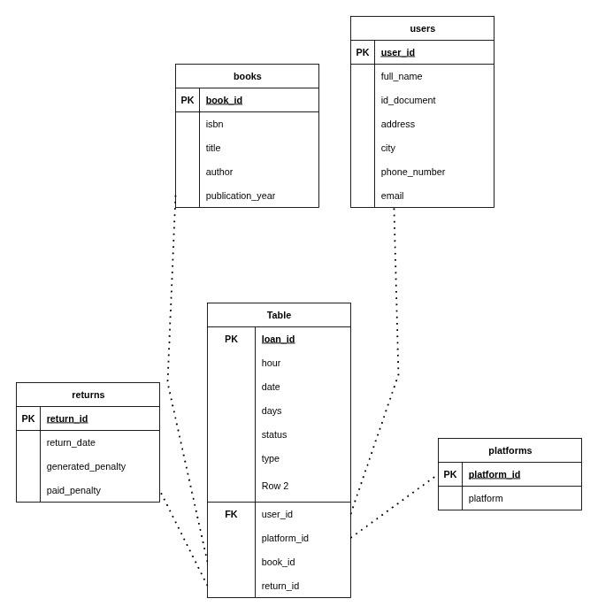

```markdown
# Library Database CRUD Project

## About
This project organizes library data into a **SQL database** with a **CRUD system** and **advanced queries**.  
We will:
- Normalize data (1NF, 2NF, 3NF)
- Create a relational model
- Build the database (DDL in English)
- Load CSV data
- Implement CRUD for 1 entity (users)
- Add an advanced queriy

---

## Steps

### 1. Normalize Data
- Open Excel file
- Remove duplicates
- Apply 1NF, 2NF, 3NF separating lists of data, dividing tables for each entity, etc
- Create diagram in Draw.io

### 2. Create Database
- Write DDL script
- Add PK, FK, constraints
- Run script before loading data

### 3. Bulk Upload
- Convert Excel to CSV
- Load into DB using script

### 4. CRUD
- Use Node.js + Express
- Validate inputs
- Simple HTML/CSS dashboard

---

## Technologies
- MySQL / MariaDB
- Node.js + Express
- HTML + CSS (Bootstrap/Tailwind/Bulma)
- Draw.io
- Postman
- Excel / CSV

---

## Run Project
1. Install dependencies  
   ```bash
   npm install
````

2. Create DB
   Run `database_creation.sql`
3. Load CSV data
4. Start server

   ```bash
   node server.js
   ```
5. Open dashboard at `http://localhost:3000`
6. Test API in Postman

---

## Diagram



---

## Developer

* Name: Angelica Cuervo
* Clan: Van Rossum
* Email: [angiemarin0707@gmail.com]

```


